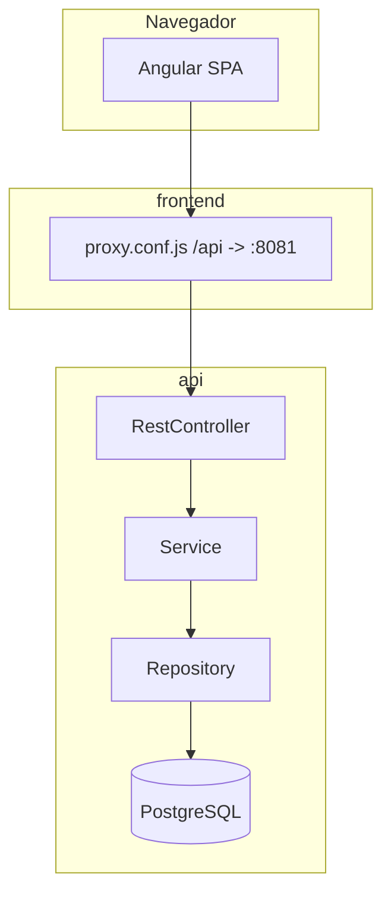

# AppGestion

**Documentación adicional:** [Despliegue en producción](docs/DEPLOY.md) · [Modelo organización / tenant](docs/TENANT-MODEL.md) · [Dependencias](docs/DEPENDENCIES.md)

---

## 📖 Descripción

**AppGestion** es un SaaS multiusuario orientado a **autónomos y pequeños negocios** para gestionar **presupuestos**, **facturas**, **clientes** y **catálogo de materiales/servicios**, con datos **aislados por usuario** (cada cuenta trabaja con su propia información).

En el código se apoya en:

- **Cuenta y seguridad:** registro e inicio de sesión (incl. Google), JWT, sesiones por dispositivo, 2FA TOTP opcional, recuperación de contraseña, invitaciones a organización, auditoría de accesos.
- **Negocio:** CRUD de clientes, materiales, presupuestos (con ítems y PDF) y facturas (ítems, PDF, cobros parciales, enlaces de pago, recordatorios, envío por correo).
- **Empresa / fiscal:** datos de empresa, métodos de cobro, recordatorios, plantillas de PDF, datos fiscales, vista previa de plantillas.
- **Panel cliente:** resumen de presupuestos y facturas por cliente (endpoint dedicado).
- **Suscripción:** integración **Stripe** (checkout, portal de cliente, facturas, webhook); en desarrollo local existe además un endpoint para simular premium (`/dev/grant-premium`, solo perfil `local`).
- **Soporte y avisos:** contacto a buzón interno (multipart), notificaciones in-app.
- **Tareas programadas:** recordatorios de factura, caducidad de trial, limpieza de sesiones y de auditoría.

No hay `docker-compose` ni `Dockerfile` en el repositorio; el arranque es local con PostgreSQL, API Maven y frontend npm.

---

## ✅ Requisitos

Versiones tomadas de `pom.xml`, `api/pom.xml`, `frontend/package.json` y `.nvmrc`:

| Tecnología | Versión / criterio |
|------------|-------------------|
| **Java** | **21** (`java.version` en `api/pom.xml`) |
| **Spring Boot** | **4.0.4** (parent `spring-boot-starter-parent` en `api/pom.xml`) |
| **Maven** | **3.9+** (no hay Maven Wrapper en el repo; usar Maven instalado) |
| **Node.js** | **`>=24.14.1`** (`engines` en `frontend/package.json`; `.nvmrc`: `24.14.1`) |
| **Angular** | **~20.3.18** (`@angular/core` y paquetes alineados en `package.json`) |
| **Angular CLI** | **^20.3.21** (`devDependencies`) |
| **TypeScript** | **~5.9.3** (`frontend/package.json`) |
| **PostgreSQL** | Servidor accesible por JDBC; por defecto la API usa **`localhost:5433`** y base **`appgestion`** (ver `application.yml`) |

---

## 🏗️ Arquitectura

Monorepo Maven en la raíz (`packaging` **pom**) con un módulo **`api`**. El frontend **no** es módulo Maven; es una aplicación **Angular** en `frontend/`.

Patrón habitual en la API: **capas** `controller` → `service` → `repository` (Spring Data JPA), entidades en `domain/entity`, DTOs en `dto`, configuración en `config`, seguridad en `security`, migraciones **Flyway** en `resources/db/migration`, jobs en `scheduler`.



**Estructura real de carpetas (resumen):**

```
AppGestion/
├── pom.xml                      # Parent Maven (módulo api)
├── api/
│   ├── pom.xml                  # Spring Boot 4, dependencias API
│   └── src/main/java/com/appgestion/api/
│       ├── config/              # Web, seguridad, migraciones, etc.
│       ├── controller/          # REST
│       ├── domain/entity|enums/
│       ├── dto/
│       ├── repository/
│       ├── scheduler/
│       ├── security/            # JWT, filtros, TOTP, UserDetails
│       └── service/
│   └── src/main/resources/
│       ├── application.yml
│       └── db/migration/        # Flyway V1..V23
├── frontend/
│   ├── package.json
│   ├── angular.json
│   ├── proxy.conf.js            # /api -> http://localhost:8081 (pathRewrite)
│   └── src/app/
│       ├── core/                # Auth, servicios HTTP, modelos
│       ├── features/            # auth, clientes, facturas, presupuestos, cuenta, etc.
│       └── shared/
├── docs/
└── README.md
```

---

## 🚀 Instalación y arranque

### Orden recomendado

1. **PostgreSQL** en ejecución y base de datos creada.  
2. **API** (`api/`, perfil `local` recomendado en desarrollo).  
3. **Frontend** (`frontend/`).  
4. **Opcional:** Stripe CLI para webhooks.

### Base de datos

Por defecto (`application.yml`): `jdbc:postgresql://localhost:5433/appgestion`, usuario/contraseña vía `DB_USERNAME` / `DB_PASSWORD` (por defecto `postgres`/`postgres`). Ajusta host/puerto si tu PostgreSQL no usa **5433**.

Ejemplo SQL (adapta nombres/contraseñas):

```sql
CREATE DATABASE appgestion;
```

### API (Spring Boot)

Desde la carpeta `api/`:

```powershell
mvn clean compile spring-boot:run
```

El `spring-boot-maven-plugin` del `api/pom.xml` arranca con perfil **`local`** (JWT de desarrollo, `app.subscription.skip-check: true`, `ddl-auto: update`, CORS ampliado para LAN en `:4200`).

Si ejecutas sin perfil `local`, define al menos **`JWT_SECRET`** (≥32 caracteres) o usa `--spring.profiles.active=local`.

La API escucha en **`http://localhost:8081`** (puerto `server.port` en `application.yml`).

### Frontend (Angular)

Desde `frontend/`:

```powershell
npm install
npm start
```

Equivale a `ng serve --host 0.0.0.0 --port 4200`. Sin CLI global, puedes usar `npx ng serve`.

La SPA queda en **`http://localhost:4200`**. Las peticiones a **`/api/...`** las reenvía `proxy.conf.js` al backend **sin** prefijo `/api` en el servidor (rewrite a rutas como `/presupuestos`, `/auth`, etc.).

### Variables de entorno relevantes (sin valores secretos)

| Variable | Uso |
|----------|-----|
| `SPRING_PROFILES_ACTIVE` | `local` / `prod` |
| `SPRING_DATASOURCE_URL` | JDBC si no usas el default del yml |
| `DB_USERNAME`, `DB_PASSWORD` | Credenciales PostgreSQL |
| `JWT_SECRET` | Obligatorio fuera de `local` (`app.jwt.secret`) |
| `CORS_ALLOWED_ORIGINS` | Orígenes permitidos (coma) |
| `MAIL_HOST`, `MAIL_PORT`, `MAIL_USERNAME`, `MAIL_PASSWORD` | SMTP (`spring.mail.*`) |
| `STRIPE_SECRET_KEY`, `STRIPE_WEBHOOK_SECRET`, `STRIPE_PRICE_MONTHLY` | Stripe (`stripe.*` + validación en prod) |
| `STRIPE_SUCCESS_URL`, `STRIPE_CANCEL_URL`, `STRIPE_PORTAL_RETURN_URL` | URLs de retorno Stripe |
| `FRONTEND_URL` | URL del front (`app.frontend-url`) |
| `SUPPORT_INBOX_EMAIL` | Buzón para formulario de soporte (`app.support.inbox-email`) |
| `TOTP_ISSUER` | Nombre del emisor en apps TOTP |
| `SESSIONS_CLEANUP_*`, `AUDIT_*` | Limpieza de sesiones y auditoría |

**Producción:** perfil `prod`, `JWT_SECRET` fuerte, CORS acotado, claves Stripe reales; ver `docs/DEPLOY.md`.

### Webhook Stripe (opcional)

```bash
stripe listen --forward-to localhost:8081/webhook/stripe
```

Configurar `STRIPE_WEBHOOK_SECRET` con el `whsec_...` que muestre Stripe.

---

## 🔌 API REST

Prefijos **tal como los expone el backend** (sin `/api`; el front añade `/api` y el proxy lo quita).

### Autenticación y cuenta (`/auth`)

| Método | Ruta | Descripción breve |
|--------|------|-------------------|
| POST | `/auth/register` | Registro |
| POST | `/auth/login` | Login |
| POST | `/auth/google` | Login con Google |
| GET | `/auth/me` | Usuario actual |
| PATCH | `/auth/profile` | Actualizar perfil |
| PATCH | `/auth/account-settings` | Ajustes de cuenta |
| PATCH | `/auth/preferences` | Preferencias |
| POST | `/auth/change-password` | Cambiar contraseña |
| POST | `/auth/totp/setup/start` | Iniciar configuración TOTP |
| POST | `/auth/totp/setup/confirm` | Confirmar TOTP |
| POST | `/auth/totp/setup/cancel` | Cancelar configuración TOTP |
| POST | `/auth/totp/disable` | Desactivar TOTP |
| POST | `/auth/forgot-password` | Solicitar reset de contraseña |
| POST | `/auth/reset-password` | Restablecer contraseña |
| POST | `/auth/invitations` | Crear invitación (roles ADMIN/USER) |
| GET | `/auth/invite/verify` | Verificar token de invitación |
| POST | `/auth/invite/accept` | Aceptar invitación |
| GET | `/auth/sessions` | Listar sesiones/dispositivos |
| DELETE | `/auth/sessions/{sessionId}` | Revocar sesión |
| DELETE | `/auth/sessions/others` | Revocar otras sesiones |
| POST | `/auth/logout` | Cerrar sesión actual |

### Soporte, notificaciones y auditoría

| Método | Ruta | Descripción breve |
|--------|------|-------------------|
| POST | `/auth/support/contact` | Contacto soporte (multipart) |
| GET | `/auth/notifications` | Listar notificaciones |
| GET | `/auth/notifications/unread-count` | Contador no leídas |
| PATCH | `/auth/notifications/{id}/read` | Marcar como leída |
| POST | `/auth/notifications/read-all` | Marcar todas leídas |
| GET | `/auth/audit-access` | Listado auditoría de accesos |
| GET | `/auth/audit-access/export` | Exportar auditoría |

### Clientes (`/clientes`)

| Método | Ruta | Descripción breve |
|--------|------|-------------------|
| GET | `/clientes` | Listar |
| GET | `/clientes/{id}` | Detalle |
| GET | `/clientes/{id}/panel` | Panel resumen cliente |
| POST | `/clientes` | Crear |
| PUT | `/clientes/{id}` | Actualizar |
| DELETE | `/clientes/{id}` | Eliminar |

### Materiales (`/materiales`)

| Método | Ruta | Descripción breve |
|--------|------|-------------------|
| GET | `/materiales` | Listar |
| GET | `/materiales/top-usados` | Más usados |
| GET | `/materiales/{id}` | Detalle (id numérico) |
| POST | `/materiales` | Crear |
| PUT | `/materiales/{id}` | Actualizar |
| DELETE | `/materiales/{id}` | Eliminar |

### Presupuestos (`/presupuestos`)

| Método | Ruta | Descripción breve |
|--------|------|-------------------|
| GET | `/presupuestos` | Listar |
| GET | `/presupuestos/{id}` | Detalle |
| GET | `/presupuestos/{id}/pdf` | PDF |
| POST | `/presupuestos/{id}/enviar-email` | Enviar por email |
| POST | `/presupuestos/{id}/factura` | Generar factura desde presupuesto |
| POST | `/presupuestos` | Crear |
| PUT | `/presupuestos/{id}` | Actualizar |
| DELETE | `/presupuestos/{id}` | Eliminar |

### Facturas (`/facturas`)

| Método | Ruta | Descripción breve |
|--------|------|-------------------|
| GET | `/facturas` | Listar |
| GET | `/facturas/{id}` | Detalle |
| GET | `/facturas/{id}/pdf` | PDF |
| POST | `/facturas/{id}/recordatorio/cobro` | Recordatorio de cobro |
| POST | `/facturas/{id}/enviar-email` | Enviar por email |
| POST | `/facturas` | Crear |
| PUT | `/facturas/{id}` | Actualizar |
| POST | `/facturas/{id}/cobros` | Registrar cobro |
| POST | `/facturas/{id}/payment-link` | Enlace de pago |
| DELETE | `/facturas/{id}` | Eliminar |

### Configuración empresa (`/config`)

| Método | Ruta | Descripción breve |
|--------|------|-------------------|
| GET | `/config/empresa` | Datos empresa |
| PUT | `/config/empresa` | Actualizar empresa |
| PATCH | `/config/empresa/metodos-cobro` | Métodos de cobro |
| PATCH | `/config/empresa/recordatorios-cobro` | Recordatorios cobro |
| PATCH | `/config/empresa/datos-fiscales` | Datos fiscales |
| PATCH | `/config/empresa/plantillas-pdf` | Plantillas PDF |
| POST | `/config/empresa/plantillas-pdf/preview` | Vista previa PDF plantillas |

### Suscripción y Stripe (`/subscription`, `/webhook`)

| Método | Ruta | Descripción breve |
|--------|------|-------------------|
| POST | `/subscription/checkout` | Checkout Stripe |
| GET | `/subscription/invoices` | Facturas Stripe |
| POST | `/subscription/portal` | Portal cliente Stripe |
| POST | `/webhook/stripe` | Webhook Stripe |

### Desarrollo local (`/dev`, perfil `local`)

| Método | Ruta | Descripción breve |
|--------|------|-------------------|
| POST | `/dev/grant-premium` | Marcar usuario actual como premium (pruebas) |

**Nota de seguridad:** En `SecurityConfig` existe regla para **`/usuarios/**`** (rol `ADMIN`). En el código actual **no hay** un `@RestController` bajo ese prefijo; si el front u otra herramienta llaman a esa ruta, el comportamiento dependerá de la configuración de seguridad y de que exista o no un controlador añadido más adelante.

---

## ⚙️ Funcionalidades (código)

Servicios Spring (`@Service`) y utilidades clave:

- **Auth:** `AuthService`, `SessionService`, `InvitacionService`, `CurrentUserService`, `JwtService`, `UserDetailsServiceImpl`, `TotpService`
- **Organización:** `OrganizationService`
- **Clientes y panel:** `ClienteService`, `ClientePanelService`
- **Materiales:** `MaterialService`
- **Presupuestos y PDF:** `PresupuestoService`, `PresupuestoPdfService`, `PlantillasPdfPreviewService`
- **Facturas:** `FacturaService`, `FacturaPdfService`, `FacturaNumeroService`, `FacturaCobroService`, `FacturaEmailService`, `FacturaPaymentLinkService`, `FacturaRecordatorioService`, `FacturaRecordatorioClienteService`
- **Empresa / correo:** `EmpresaService`, `EmailService`, `SupportService`
- **Suscripción:** `SubscriptionService`, `StripeService`
- **Notificaciones:** `NotificacionService`
- **Auditoría:** `AuditAccessService`, `AuditAccessCleanupService`
- **Limpieza sesiones:** `UsuarioSesionCleanupService`
- **Utilidades (no `@Service`):** `DocumentTemplateService`, `WhatsAppLinkService` (plantillas texto PDF, enlaces WhatsApp)

**Schedulers:** `FacturaRecordatorioJob`, `TrialExpirationJob`, `UsuarioSesionCleanupJob`, `AuditAccessCleanupJob`.

**Consejo global:** `GlobalExceptionHandler` (`@RestControllerAdvice`).

---

## 🗄️ Base de datos (Flyway)

Migraciones en `api/src/main/resources/db/migration/` (**V1** a **V23**), incluyendo entre otras:

- **V1:** esquema inicial (`usuarios`, `empresas`, `clientes`, `materiales`, `presupuestos`, `presupuesto_items`, `facturas`, `factura_items`, …)
- Evolución posterior: reset password, recordatorios, cobros, organizaciones/membresías, invitaciones, datos fiscales, logo, métodos de cobro, TOTP, notificaciones, sesiones, auditoría de accesos, rubro autónomo, recordatorios cliente, etc.

Hibernate `ddl-auto`: **`validate`** por defecto y en `prod`; **`update`** solo en perfil **`local`**.

---

## 📚 Dependencias y licencia

- Detalle de librerías: [`docs/DEPENDENCIES.md`](docs/DEPENDENCIES.md) y [`frontend/README.md`](frontend/README.md).
- **Licencia:** proyecto privado.
