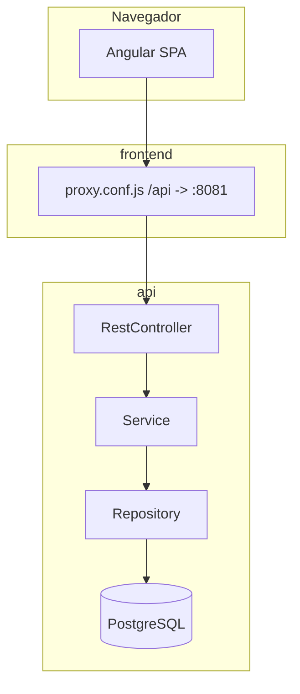

# AppGestion

Documentación de IA para presupuestos: [docs/IA-PRESUPUESTOS.md](docs/IA-PRESUPUESTOS.md).

**Documentación adicional:** [Despliegue en producción](docs/DEPLOY.md) · [Enlace público de presupuestos](docs/ENLACE-PUBLICO.md) · [OAuth correo Gmail/Microsoft (local)](docs/EMAIL-OAUTH-SETUP.md) · [Modelo organización / tenant](docs/TENANT-MODEL.md) · [Dependencias](docs/DEPENDENCIES.md) · [Frontend](frontend/README.md) · [Diagnóstico recuperación de contraseña / correo](docs/TROUBLESHOOTING-PASSWORD-RESET.md)

### Enlaces públicos de presupuestos

La API ofrece `POST /presupuestos/{id}/enlace` para crear otro enlace por envío, `POST /presupuestos/{id}/enlace/regenerar` para revocarlos todos y crear uno, `DELETE /presupuestos/{id}/enlace` para revocarlos todos y `GET /presupuestos/{id}/enlace/estado` (autenticados), además de `GET /publico/presupuestos/{token}`, `GET /publico/presupuestos/{token}/pdf` y `POST /publico/presupuestos/{token}/visto` (anónimos). Hay un máximo configurable de 10 enlaces activos por presupuesto; volver a enviar no invalida los anteriores. Configura `app.frontend-url`, `app.public-links.expiry-days` (60 días), `app.public-links.max-active-links` (10), `app.public-links.trusted-proxies`, `app.public-links.rate-limit-per-ip` (10000/minuto) y `app.public-links.rate-limit-per-token` (60/minuto). Por defecto no se confía en `X-Forwarded-For`; configura la lista CIDR de proxies con `app.public-links.trusted-proxies` o `PUBLIC_BUDGET_LINK_TRUSTED_PROXIES`. Configura el proxy para sobrescribir `X-Forwarded-For`; el limitador Caffeine es local por instancia. El PDF público solo muestra el nombre del cliente, sin NIF, teléfono, email ni dirección. El hosting frontend debe enviar `X-Robots-Tag: noindex, nofollow` y `Referrer-Policy: no-referrer` en `/p/*`. Consulta [el modelo de amenazas, límites, datos expuestos y texto recomendado para privacidad](docs/ENLACE-PUBLICO.md).

---

## 📖 Descripción

**AppGestion** es un SaaS multiusuario orientado a **autónomos y pequeños negocios** para gestionar **presupuestos**, **facturas**, **clientes** y **catálogo de materiales/servicios**, con datos **aislados por usuario** (cada cuenta trabaja con su propia información).

En el código se apoya en:

- **Cuenta y seguridad:** registro e inicio de sesión (incl. Google), JWT, sesiones por dispositivo, 2FA TOTP opcional, recuperación de contraseña, invitaciones a organización, auditoría de accesos.
- **Negocio:** CRUD de clientes, materiales, presupuestos (con ítems y PDF) y facturas (ítems, PDF, cobros parciales, enlaces de pago, recordatorios, envío por correo).
- **Empresa / fiscal:** datos de empresa, métodos de cobro, recordatorios, plantillas de PDF, datos fiscales, vista previa de plantillas.
- **Panel cliente:** resumen de presupuestos y facturas por cliente (endpoint dedicado).
- **Suscripción:** integración **Stripe** (checkout, portal de cliente, facturas, webhook). Para usuarios de prueba, se recomienda activar premium editando directamente el estado del usuario en PostgreSQL.
- **Soporte y avisos:** contacto a buzón interno (multipart), notificaciones in-app.
- **Tareas programadas:** recordatorios de factura, caducidad de trial, limpieza de sesiones y de auditoría.

No hay `docker-compose` ni `Dockerfile` en el repositorio; el arranque es local con PostgreSQL, API Maven y frontend npm.

---

## ✅ Requisitos

Versiones tomadas de `pom.xml`, `api/pom.xml`, `frontend/package.json` y `.nvmrc`:

| Tecnología | Versión / criterio |
|------------|-------------------|
| **Java** | **21** (`java.version` en `pom.xml` raíz) |
| **Spring Boot** | **4.1.0** (parent `spring-boot-starter-parent` en `pom.xml` raíz) |
| **Maven** | **3.9+** (no hay Maven Wrapper en el repo; usar Maven instalado) |
| **Node.js** | **`>=24.14.1`** (`engines` en `frontend/package.json`; `.nvmrc`: `24.14.1`) |
| **Angular** | **~21.2** (`@angular/core` y paquetes alineados en `frontend/package.json`) |
| **Angular CLI** | **^21.2** (`devDependencies`) |
| **TypeScript** | **~6.0** (`frontend/package.json`) |
| **PostgreSQL** | Servidor accesible por JDBC; por defecto la API usa **`localhost:5432`** y base **`appgestion`** (ver `application.yml`) |

---

## 🏗️ Arquitectura

Monorepo Maven en la raíz (`packaging` **pom**) con un módulo **`api`**. El frontend **no** es módulo Maven; es una aplicación **Angular** en `frontend/`.

Patrón habitual en la API: **capas** `controller` → `service` → `repository` (Spring Data JPA), entidades en `domain/entity`, DTOs en `dto`, configuración en `config`, seguridad en `security`, migraciones **Flyway** en `resources/db/migration`, jobs en `scheduler`.

Los controllers **no** acceden a repositorios directamente (regla **ArchUnit** en `api/src/test/.../ArchitectureTest.java`). Quedan por migrar a servicio: `DevController`, `ResendWebhookController`.

**Caché in-memory (Caffeine):** `GET /materiales/top-usados` se cachea por **`usuarioId`** (TTL 5 min; invalidación al crear/editar/borrar material). Sin Redis ni infra adicional.


```mermaid
flowchart TB
  subgraph client [Navegador]
    NG[Angular SPA]
  end
  subgraph fe [frontend]
    Proxy["proxy.conf.js /api -> :8081"]
  end
  subgraph api [api]
    C[RestController]
    S[Service]
    R[Repository]
    DB[(PostgreSQL)]
  end
  NG --> Proxy
  Proxy --> C
  C --> S
  S --> R
  R --> DB
```

**Estructura real de carpetas (resumen):**

```
AppGestion/
├── pom.xml                      # Parent Maven (módulo api)
├── api/
│   ├── pom.xml                  # Spring Boot 4, dependencias API
│   └── src/main/java/com/appgestion/api/
│       ├── config/              # Web, seguridad, migraciones, etc.
│       ├── controller/          # REST
│       ├── domain/entity|enums/
│       ├── dto/
│       ├── repository/
│       ├── scheduler/
│       ├── security/            # JWT, filtros, TOTP, UserDetails
│       └── service/
│   └── src/main/resources/
│       ├── application.yml
│       └── db/migration/        # Flyway V1..V36
├── frontend/
│   ├── package.json
│   ├── angular.json
│   ├── proxy.conf.js            # /api -> http://localhost:8081 (pathRewrite)
│   └── src/app/
│       ├── core/                # Auth, servicios HTTP, modelos, utils (p. ej. cálculo presupuesto/cobro)
│       ├── features/            # auth, clientes, facturas, presupuestos, cuenta, etc.
│       └── shared/
├── docs/
└── README.md
```

---

## 🚀 Instalación y arranque

### Orden recomendado

1. **PostgreSQL** en ejecución y base de datos creada.  
2. **API** (`api/`, perfil `local` recomendado en desarrollo).  
3. **Frontend** (`frontend/`).  
4. **Opcional:** Stripe CLI para webhooks.

### Base de datos

Por defecto (`application.yml`): `jdbc:postgresql://localhost:5432/appgestion`, usuario/contraseña vía `DB_USERNAME` / `DB_PASSWORD` (por defecto `postgres`/`postgres`). Ajusta host/puerto si tu PostgreSQL no usa **5432**.

Ejemplo SQL (adapta nombres/contraseñas):

```sql
CREATE DATABASE appgestion;
```

### API (Spring Boot)

Para iniciar el entorno local completo (PostgreSQL, API y frontend), ejecuta el comando correspondiente a la carpeta que aparece en tu prompt:

Si estás en la raíz del repositorio `Proyectos` (`...\Proyectos>`):

```powershell
powershell.exe -NoProfile -ExecutionPolicy Bypass -File .\AppGestion\start-local.ps1
```

Si ya estás dentro de `AppGestion` (`...\Proyectos\AppGestion>`):

```powershell
powershell.exe -NoProfile -ExecutionPolicy Bypass -File .\start-local.ps1
```

El script comprueba/inicia PostgreSQL en `localhost:5432`, pide la contraseña sin mostrarla (Enter usa `postgres`) y arranca API y frontend en segundo plano. Por defecto activa Gemini; añade `-DisableGemini` al comando para arrancar sin la integración de IA. Si encuentra la API o el frontend de AppGestion en `8081` o `4200`, los reinicia; si el puerto pertenece a otro programa, se detiene sin cerrarlo. Los logs quedan bajo `api/target/` y `frontend/target/`.

Desde la carpeta `api/`:

```powershell
mvn clean compile spring-boot:run
```

El `spring-boot-maven-plugin` del `api/pom.xml` arranca con perfil **`local`** (JWT de desarrollo, `app.subscription.skip-check: true`, `ddl-auto: update`, CORS ampliado para LAN en `:4200`).

Si ejecutas sin perfil `local`, define al menos **`JWT_SECRET`** (≥32 caracteres) o usa `--spring.profiles.active=local`.

La API escucha en **`http://localhost:8081`** (puerto `server.port` en `application.yml`).

#### Desarrollo local: activar la extracción de gastos con Gemini

Estos pasos son **solo para desarrollo local**: configuran el proceso Maven que arrancas desde esta ventana de PowerShell y no cambian el despliegue ni la configuración de producción. Gemini está desactivado por defecto. Ajusta la URL y las credenciales de PostgreSQL a tu instalación; si PostgreSQL escucha en `5432`, usa esta URL:

```powershell
$env:SPRING_DATASOURCE_URL = "jdbc:postgresql://localhost:5432/appgestion"
$env:DB_USERNAME = "postgres"
$env:DB_PASSWORD = "<contraseña de PostgreSQL>"
$env:PORT = "8081"
$env:APP_AI_GEMINI_ENABLED = "true"
$secureKey = Read-Host "Pega la clave nueva de Gemini (no se mostrará)" -AsSecureString
$keyPointer = [Runtime.InteropServices.Marshal]::SecureStringToBSTR($secureKey)
try {
    $env:GEMINI_API_KEY = [Runtime.InteropServices.Marshal]::PtrToStringBSTR($keyPointer)
} finally {
    [Runtime.InteropServices.Marshal]::ZeroFreeBSTR($keyPointer)
    Remove-Variable secureKey, keyPointer
}
if ([string]::IsNullOrWhiteSpace($env:GEMINI_API_KEY)) { throw "GEMINI_API_KEY está vacío" }
.\mvnw.cmd -pl api spring-boot:run
```

Genera la clave en Google AI Studio y no la guardes en el repositorio ni la compartas en logs o mensajes. La comprobación solo indica si falta la clave; no la imprime. Ejecuta todos los comandos y Maven en la misma ventana de PowerShell. Si la API ya estaba ejecutándose, detenla y vuelve a arrancarla después de definir las variables: los cambios de entorno no se aplican a un proceso que ya está activo. El servicio local quedará disponible en `http://localhost:8081`; el frontend en `http://localhost:4200` usa ese puerto mediante `frontend/proxy.conf.js`.

Con la API y el frontend en marcha, inicia sesión y abre **Gastos → Nuevo gasto**. En el formulario, selecciona una imagen o PDF de factura/ticket y pulsa **Extraer datos**. La respuesta se carga como borrador editable; revisa los campos señalados y pulsa **Crear** cuando esté listo. La extracción no guarda el gasto automáticamente.

### Frontend (Angular)

Desde `frontend/`:

```powershell
npm install
npm start
```

Equivale a `ng serve --host 0.0.0.0 --port 4200`. Sin CLI global, puedes usar `npx ng serve`.

La SPA queda en **`http://localhost:4200`**. Las peticiones a **`/api/...`** las reenvía `proxy.conf.js` al backend **sin** prefijo `/api` en el servidor (rewrite a rutas como `/presupuestos`, `/auth`, etc.).

### Referencia de variables de entorno (nombres, sin valores secretos)

Esta tabla es una referencia de nombres que reconoce la aplicación. Los comandos anteriores configuran **solo el entorno local**. Para producción, configura los valores como secretos/variables en la plataforma de despliegue y sigue [Despliegue en producción](docs/DEPLOY.md); no reutilices allí las credenciales locales ni la clave de desarrollo.

| Variable | Uso |
|----------|-----|
| `SPRING_PROFILES_ACTIVE` | `local` / `prod` |
| `SPRING_DATASOURCE_URL` | JDBC si no usas el default del yml |
| `DB_USERNAME`, `DB_PASSWORD` | Credenciales PostgreSQL |
| `APP_AI_GEMINI_ENABLED` | Activa (`true`) o desactiva (`false`) la extracción de gastos y los borradores de presupuestos con IA; desactivada por defecto |
| `GEMINI_API_KEY` | Clave de Google AI Studio; obligatoria si Gemini está activado |
| `APP_AI_GEMINI_MODEL` | Modelo Gemini usado por backend; por defecto `gemini-3.5-flash-lite`. Se selecciona solo mediante esta variable |
| `APP_AI_PRESUPUESTO_REQUESTS_PER_DAY` | Máximo diario de borradores IA por usuario e instancia; por defecto `20` |
| `APP_AI_GEMINI_MAX_ATTEMPTS_PER_HOUR` | Máximo de intentos HTTP enviados a Gemini por usuario e instancia por hora; cuenta fallos y reintentos; por defecto `60` |
| `APP_AI_EVAL_GEMINI` | Variable de test: con valor `true` habilita la evaluación manual real `PresupuestoIaGeminiEvaluationTest`; no activa funciones de producción |
| `JWT_SECRET` | Obligatorio fuera de `local` (`app.jwt.secret`) |
| `CORS_ALLOWED_ORIGINS` | Orígenes permitidos (coma) |
| `MAIL_HOST`, `MAIL_PORT`, `MAIL_USERNAME`, `MAIL_PASSWORD` | SMTP (`spring.mail.*`) |
| `STRIPE_SECRET_KEY`, `STRIPE_WEBHOOK_SECRET`, `STRIPE_PRICE_MONTHLY`, `STRIPE_PRICE_YEARLY` | Stripe (`stripe.*` + validación en prod) |
| `STRIPE_SUCCESS_URL`, `STRIPE_CANCEL_URL`, `STRIPE_PORTAL_RETURN_URL` | URLs de retorno Stripe |
| `FRONTEND_URL` | URL del front (`app.frontend-url`); en producción: `https://noemiweb.com` |
| `SUPPORT_INBOX_EMAIL` | Buzón para formulario de soporte (`app.support.inbox-email`) |
| `TOTP_ISSUER` | Nombre del emisor en apps TOTP |
| `SESSIONS_CLEANUP_*`, `AUDIT_*` | Limpieza de sesiones y auditoría |

#### Producción

Las instrucciones de publicación, variables obligatorias, CORS y secretos de producción están separadas en [Despliegue en producción](docs/DEPLOY.md). No uses el bloque PowerShell de desarrollo local para desplegar.

### Webhook Stripe (opcional)

```bash
stripe listen --forward-to localhost:8081/webhook/stripe
```

Configurar `STRIPE_WEBHOOK_SECRET` con el `whsec_...` que muestre Stripe.

### Mensual y anual en la pasarela Stripe (upsell)

El checkout abre siempre con el **precio mensual** cuando existen `STRIPE_PRICE_MONTHLY` y `STRIPE_PRICE_YEARLY`. Para que el cliente vea **ambas opciones dentro de Stripe Checkout**, configura un **subscription upsell** en el Dashboard:

1. **Productos** → tu plan → abre el **precio mensual** (`STRIPE_PRICE_MONTHLY`).
2. En **Upsells**, elige el precio anual (`STRIPE_PRICE_YEARLY`).
3. Ambos precios deben ser del **mismo producto**, misma moneda y tipo recurrente.

Documentación: [Stripe subscription upsells](https://docs.stripe.com/payments/checkout/upsells).

---

## Tests

| Módulo | Comando | Runner / notas |
|--------|---------|----------------|
| **API** | `mvn test` (desde `api/`) | JUnit 5, Mockito, Testcontainers (PostgreSQL en integración), ArchUnit |
| **Frontend** | `npm test` (desde `frontend/`) | Vitest vía `ng test` (`@angular/build:unit-test`) |

**Backend:** suites de integración (auth JWT/TOTP, multitenancy, facturas, presupuestos, fiscal, PDF, validación/IDOR) y unitarias (servicios, Stripe webhook, arquitectura de capas, caché multi-tenant de materiales).

**Frontend:** specs en `core/auth/` (servicio, guards, interceptor, JWT sid), `core/utils/` (cálculo de totales/IVA de presupuesto, importe pendiente de cobro en facturas), servicios HTTP (`factura`, `presupuesto`, etc.) e i18n.

Perfil de test API: `@ActiveProfiles("test")` con H2 en memoria (`application-test.properties`).

---

## 🔌 API REST

Prefijos **tal como los expone el backend** (sin `/api`; el front añade `/api` y el proxy lo quita).

### Autenticación y cuenta (`/auth`)

| Método | Ruta | Descripción breve |
|--------|------|-------------------|
| POST | `/auth/register` | Registro |
| POST | `/auth/login` | Login |
| POST | `/auth/google` | Login con Google |
| GET | `/auth/me` | Usuario actual |
| PATCH | `/auth/profile` | Actualizar perfil |
| PATCH | `/auth/account-settings` | Ajustes de cuenta |
| PATCH | `/auth/preferences` | Preferencias |
| POST | `/auth/change-password` | Cambiar contraseña |
| POST | `/auth/totp/setup/start` | Iniciar configuración TOTP |
| POST | `/auth/totp/setup/confirm` | Confirmar TOTP |
| POST | `/auth/totp/setup/cancel` | Cancelar configuración TOTP |
| POST | `/auth/totp/disable` | Desactivar TOTP |
| POST | `/auth/forgot-password` | Solicitar reset de contraseña |
| POST | `/auth/reset-password` | Restablecer contraseña |
| POST | `/auth/invitations` | Crear invitación (roles ADMIN/USER) |
| GET | `/auth/invite/verify` | Verificar token de invitación; respuesta JSON con único campo `valid` (booleano); no devuelve email |
| POST | `/auth/invite/accept` | Aceptar invitación |
| GET | `/auth/sessions` | Listar sesiones/dispositivos |
| DELETE | `/auth/sessions/{sessionId}` | Revocar sesión |
| DELETE | `/auth/sessions/others` | Revocar otras sesiones |
| POST | `/auth/logout` | Cerrar sesión actual |

**Referidos y enlace de invitación**

- El correo de referido apunta al front en **`https://noemiweb.com/login?ref=<token>`** (y las rutas antiguas `/invite/:token` redirigen allí). El usuario elige el email en **`https://noemiweb.com/register?ref=<token>`**.
- **`GET /auth/invite/verify?token=...`** (público): respuesta JSON **`{ "valid": true|false }`**. No incluye el email del destinatario; solo indica si el token existe, no está usado y no ha caducado.
- **`POST /auth/register`**: cuerpo opcional **`referralToken`** (el mismo valor que en `ref`). Si es válido, el backend registra el referido y aplica la prueba según la lógica del servidor.

### Soporte, notificaciones y auditoría

| Método | Ruta | Descripción breve |
|--------|------|-------------------|
| POST | `/auth/support/contact` | Contacto soporte (multipart) |
| GET | `/auth/notifications` | Listar notificaciones |
| GET | `/auth/notifications/unread-count` | Contador no leídas |
| PATCH | `/auth/notifications/{id}/read` | Marcar como leída |
| POST | `/auth/notifications/read-all` | Marcar todas leídas |
| GET | `/auth/audit-access` | Listado auditoría de accesos |
| GET | `/auth/audit-access/export` | Exportar auditoría |

### Clientes (`/clientes`)

| Método | Ruta | Descripción breve |
|--------|------|-------------------|
| GET | `/clientes` | Listar |
| GET | `/clientes/{id}` | Detalle |
| GET | `/clientes/{id}/panel` | Panel resumen cliente |
| POST | `/clientes` | Crear |
| PUT | `/clientes/{id}` | Actualizar |
| DELETE | `/clientes/{id}` | Eliminar |

### Materiales (`/materiales`)

| Método | Ruta | Descripción breve |
|--------|------|-------------------|
| GET | `/materiales` | Listar |
| GET | `/materiales/top-usados` | Más usados en presupuestos (caché Caffeine 5 min por usuario) |
| GET | `/materiales/{id}` | Detalle (id numérico) |
| POST | `/materiales` | Crear |
| PUT | `/materiales/{id}` | Actualizar |
| DELETE | `/materiales/{id}` | Eliminar |

### Gastos (`/gastos`)

Registro manual de compras/gastos con IVA soportado. La cuota IVA de los gastos del trimestre se agrega al resumen orientativo **`GET /fiscal/modelo303`** (`ivaSoportado`). Aislamiento por `usuario_id`.

| Método | Ruta | Descripción breve |
|--------|------|-------------------|
| GET | `/gastos` | Listar (orden por fecha desc) |
| GET | `/gastos/{id}` | Detalle |
| POST | `/gastos` | Crear |
| PUT | `/gastos/{id}` | Actualizar |
| DELETE | `/gastos/{id}` | Eliminar |

### Presupuestos (`/presupuestos`)

| Método | Ruta | Descripción breve |
|--------|------|-------------------|
| GET | `/presupuestos` | Listar |
| GET | `/presupuestos/{id}` | Detalle |
| GET | `/presupuestos/{id}/pdf` | PDF |
| POST | `/presupuestos/{id}/enviar-email` | Enviar por email |
| POST | `/presupuestos/ia/borrador` | Generar borrador editable desde texto; sin persistencia y con precios solo desde el catálogo del usuario |
| POST | `/presupuestos/{id}/factura` | Generar factura desde presupuesto |
| POST | `/presupuestos` | Crear |
| PUT | `/presupuestos/{id}` | Actualizar |
| DELETE | `/presupuestos/{id}` | Eliminar |

### Facturas (`/facturas`)

| Método | Ruta | Descripción breve |
|--------|------|-------------------|
| GET | `/facturas` | Listar |
| GET | `/facturas/{id}` | Detalle |
| GET | `/facturas/{id}/pdf` | PDF |
| POST | `/facturas/{id}/recordatorio/cobro` | Recordatorio de cobro |
| POST | `/facturas/{id}/enviar-email` | Enviar por email |
| POST | `/facturas` | Crear |
| PUT | `/facturas/{id}` | Actualizar |
| POST | `/facturas/{id}/cobros` | Registrar cobro |
| POST | `/facturas/{id}/payment-link` | Enlace de pago |
| DELETE | `/facturas/{id}` | Eliminar |

### Configuración empresa (`/config`)

| Método | Ruta | Descripción breve |
|--------|------|-------------------|
| GET | `/config/empresa` | Datos empresa |
| PUT | `/config/empresa` | Actualizar empresa |
| PATCH | `/config/empresa/metodos-cobro` | Métodos de cobro |
| PATCH | `/config/empresa/recordatorios-cobro` | Recordatorios cobro |
| PATCH | `/config/empresa/datos-fiscales` | Datos fiscales |
| PATCH | `/config/empresa/plantillas-pdf` | Plantillas PDF |
| POST | `/config/empresa/plantillas-pdf/preview` | Vista previa PDF plantillas |

### Suscripción y Stripe (`/subscription`, `/webhook`)

| Método | Ruta | Descripción breve |
|--------|------|-------------------|
| POST | `/subscription/checkout` | Checkout Stripe (precio mensual base; mensual/anual en pasarela si el upsell está configurado en Stripe) |
| GET | `/subscription/invoices` | Facturas Stripe |
| POST | `/subscription/portal` | Portal cliente Stripe |
| POST | `/webhook/stripe` | Webhook Stripe |
| POST | `/webhook/resend` | Webhook Resend (bounces, etc.). Con `RESEND_WEBHOOK_SECRET` se valida la firma Svix (`svix-*`). |

En producción, configura **`RESEND_WEBHOOK_SECRET`** con el signing secret del webhook en el dashboard de Resend. Si está vacío, el endpoint no verifica firma (útil solo en desarrollo aislado).

### Premium de prueba por base de datos

Para activar premium sin pasar por Stripe en un usuario concreto, actualiza su estado en PostgreSQL:

```sql
UPDATE usuarios
SET subscription_status = 'ACTIVE',
    stripe_customer_id = NULL,
    stripe_subscription_id = NULL,
    stripe_price_id = NULL,
    subscription_current_period_end = NULL,
    subscription_cancel_at_period_end = false,
    subscription_requires_payment_action = false
WHERE lower(email) = lower('tu@email.com');
```

Luego cierra sesión y vuelve a entrar, o refresca `/auth/me`, para que el frontend reciba `canWrite=true`.

---

## ⚙️ Funcionalidades (código)

Servicios Spring (`@Service`) y utilidades clave:

- **Auth:** `AuthService`, `SessionService`, `InvitacionService`, `CurrentUserService`, `JwtService`, `UserDetailsServiceImpl`, `TotpService`
- **Organización:** `OrganizationService`
- **Clientes y panel:** `ClienteService`, `ClientePanelService`
- **Materiales:** `MaterialService` (incl. ranking top-usados cacheado)
- **Presupuestos y PDF:** `PresupuestoService`, `PresupuestoPdfService`, `PlantillasPdfPreviewService`
- **Facturas:** `FacturaService`, `FacturaPdfService`, `FacturaNumeroService`, `FacturaCobroService`, `FacturaEmailService`, `FacturaPaymentLinkService`, `FacturaRecordatorioService`, `FacturaRecordatorioClienteService`
- **Empresa / correo:** `EmpresaService`, `EmailService`, `SupportService`
- **Suscripción:** `SubscriptionService`, `StripeService`, `StripeWebhookService`
- **Notificaciones:** `NotificacionService`
- **Auditoría:** `AuditAccessService`, `AuditAccessCleanupService`
- **Limpieza sesiones:** `UsuarioSesionCleanupService`
- **Utilidades frontend (`core/utils/`):** `presupuesto-costes.util`, `factura-cobro.util` (preview de totales/cobros en formularios)
- **Utilidades API (no `@Service`):** `DocumentTemplateService`, `WhatsAppLinkService` (plantillas texto PDF, enlaces WhatsApp)

**Config relevante:** `CacheConfig` (Caffeine), `SecurityConfig`, `GlobalExceptionHandler` (`@RestControllerAdvice`).

**Schedulers:** `FacturaRecordatorioJob`, `TrialExpirationJob`, `UsuarioSesionCleanupJob`, `AuditAccessCleanupJob`.

---

## 🗄️ Base de datos (Flyway)

Migraciones en `api/src/main/resources/db/migration/` (**V1** a **V36**), incluyendo entre otras:

- **V1:** esquema inicial (`usuarios`, `empresas`, `clientes`, `materiales`, `presupuestos`, `presupuesto_items`, `facturas`, `factura_items`, …)
- Evolución posterior: reset password, recordatorios, cobros, organizaciones/membresías, invitaciones, datos fiscales, logo, métodos de cobro, TOTP, notificaciones, sesiones, auditoría de accesos, rubro autónomo, recordatorios cliente, anticipo fiscal, email híbrido/outbox, Stripe billing, índices de rendimiento, etc.

Hibernate `ddl-auto`: **`validate`** por defecto y en `prod`; **`update`** solo en perfil **`local`**.

---

## 📚 Dependencias y licencia

- Detalle de librerías: [`docs/DEPENDENCIES.md`](docs/DEPENDENCIES.md) y [`frontend/README.md`](frontend/README.md).
- **Documentación:** mantener alineadas versiones con `pom.xml`, `frontend/package.json` y migraciones Flyway (`db/migration/`).
- **Licencia:** proyecto privado.
